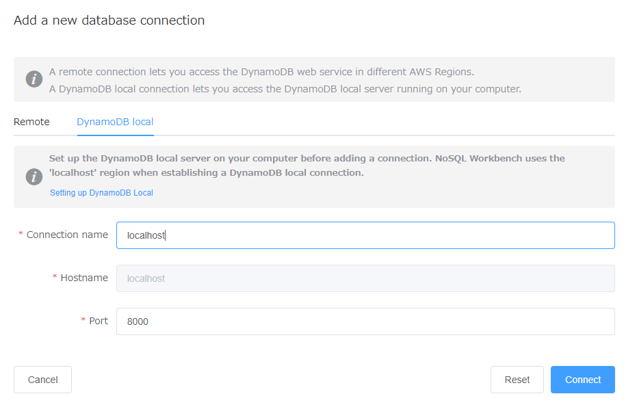
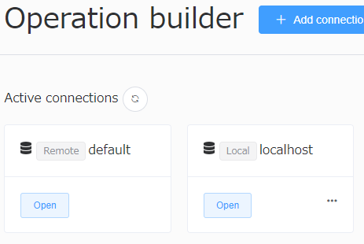
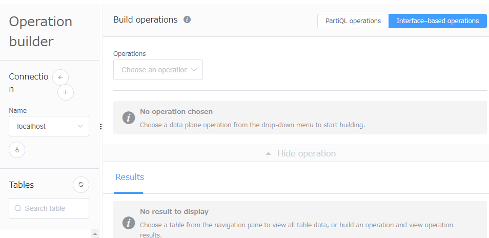

# DynamoDB local with Go (using aws-sdk-go-v2)
ローカル環境に構築したDynamoDB local を Go でつないでいろいろと操作を試してみました。  
`github.com/aws/aws-sdk-go-v2` を使っていますが、ググっても v2 で DynamoDB local に接続する方法を説明している日本語の記事が見つからなかったので、こちらにノウハウを残しておきます。

## What is "DynamoDB local"?
DynamoDB local はAWSが提供する、DynamoDBをローカル環境で、無料で動かせるサービスです。  
Docker or 実行ファイル をダウンロードするだけで構築でき、実装やテストをローカル環境だけで完結できるようになります。  
Webサービスの DynamoDB とつなぐと使い方によっては料金が発生することがありますが、DynamoDB local はその心配はありません。(テスト用に最適！)

## Content

- [[Change History](#change-history)]
- [環境情報](#環境情報)
- [事前準備](#事前準備)
- [DynamoDB local のセットアップ](#dynamodb-local-のセットアップ)
- [NoSQL Workbench のセットアップ](#nosql-workbench-のセットアップ)
- [DynamoDB local にテーブルを作成し、データを投入](#dynamodb-local-にテーブル作成・データ取込)
- [Go (aws-sdk-go-v2) で DynamoDB local に接続する](#go-aws-sdk-go-v2-で-dynamodb-local-に接続する)
- [参考記事](#参考記事)

#### [Change History]

2022.12.06 初版 S.Tokumaru

## 環境情報
```
OS:             Windows11  
Go:             go1.19.2 windows/amd64
Java:           openjdk version "1.8.0_312"
DynamoDB local: 1.20.0
```

## 事前準備
- aws-cli のインストール
- Java のインストール (Docker使う場合は不要)

## DynamoDB local のセットアップ
AWSの公式に DynamoDB local をインストールしてローカル環境でアプリを起動するまでの手順が記載してあります。  
[Deploying DynamoDB locally on your computer](https://docs.aws.amazon.com/amazondynamodb/latest/developerguide/DynamoDBLocal.DownloadingAndRunning.html)  

ローカルにDocker環境がある人は、Dockerのコンテナを立てるやり方がよさそうです。  
(自分みたいに)もしDocker環境が使えない場合は、実行ファイル(.jar)を使うやり方でもOKです。  

インストールが完了したら、DynamoDB local を起動してみます。  
※実行ファイルでDynamoDB local を構築するコマンド
Linux
```bash
$ java -Djava.library.path=./DynamoDBLocal_lib -jar DynamoDBLocal.jar -sharedDb
```
Command Prompt/PowerShell
```ps
> java -D"java.library.path=./DynamoDBLocal_lib" -jar DynamoDBLocal.jar
```
無事、起動できたら、接続確認してみます。  
DynamoDB local に接続する前に、aws configure で 接続情報を設定します。設定する値は以下のような感じで適当でOKです。(値がないと接続できないよう)
```
AWS Access Key ID: "fakeMyKeyId"
AWS Secret Access Key: "fakeSecretAccessKey"
AWS Region: "localhost"
```
接続情報の設定ができたら、正しく接続できるか確認します。  
ローカルに立てたDynamoDB local につなぐために、接続先URLを明示的に指定する必要があります。
```bash
$ aws dynamodb list-tables --endpoint-url http://localhost:8000
```

## NoSQL Workbench のセットアップ
SQL Workbench のNoSQL版のようなクライアントアプリがAWSから提供されています。  
これ以降の手順ではNoSQL Workbenchを使うので、ぜひインストールして使ってみてください。  
[NoSQL Workbench のダウンロード](https://docs.aws.amazon.com/ja_jp/amazondynamodb/latest/developerguide/workbench.settingup.html)  

インストールが完了したらアプリを起動して、DynamoDB local に接続してみます。  
サイドメニュー「Operation builder」を選択して、画面上部の「+ Add Connection」をクリックすると、「Add a new database connection」というタイトルの画面が開きます。



「Remote」と「DynamoDB local」2つのタブが表示されますが、DynamoDB localにつなぐので「DynamoDB local」を選択し、任意のConnection name と Port を入力して「Connect」をクリックします。  
接続に成功すると、以下のように接続先に localhost が追加されます。



「Open」をクリックすると、以下のような管理画面が開きます。  
画面左側の鍵マークをクリックすると、ランダムに設定されたAWSの Access Key と Secret Access Key を取得することができます。(Regionはデフォルトでlocalhost)  
※NoSQL Workbenchから接続すると、接続ごとランダムに生成した接続情報が割り当てられるらしい



## DynamoDB local にテーブル作成・データ取込
DynamoDB local を立てただけではテーブルもデータもないので、テーブルを作成して、データを登録してみます。  
テーブル作成・データ取込用のバッチファイルとシェルスクリプトを用意しているので、こちらを利用ください。(NoSQL Workbench の画面からも実施可能)  
※シェルスクリプトについては動作確認が取れていないので、もし不具合あればお知らせください。

Linux
```bash
# resources 以下に移動
$ cd ./resources

# テーブル作成・データ取込用のスクリプトを実行
$ ./ddl.sh {Access Key} {Secret Access Key}

# ProductCatalogにGSIを追加するスクリプトを実行
$ ./add_gsi_to_ProductCatalog.sh {Access Key} {Secret Access Key}
```

Command Prompt/PowerShell
```ps
# resources 以下に移動
> cd .\resources

# テーブル作成・データ取込用のスクリプトを実行
> .\ddl.bat {Access Key} {Secret Access Key}

# ProductCatalogにGSIを追加するスクリプトを実行
> .\add_gsi_to_ProductCatalog.bat {Access Key} {Secret Access Key}
```

※テーブルの削除は以下のスクリプトで実行可能

Linux
```bash
# resources 以下に移動
$ cd ./resources

# テーブルを削除するスクリプトを実行
$ ./teardown.sh {Access Key} {Secret Access Key}
```

Command Prompt/PowerShell
```ps
# resources 以下に移動
> cd .\resources

# テーブル作成・データ取込用のスクリプトを実行
> .\teardown.bat {Access Key} {Secret Access Key}
```


## Go (aws-sdk-go-v2) で DynamoDB local に接続する
以下は `main.go` から抜粋した `*dynamodb.Client` を生成するコードです。  
ひとまず以下のように書けば、DynamoDB local に接続できること確認できています。  
※{Access Key} {Secret Access Key} は環境ごと設定してください

```Go
package main

import (
	"context"
	"fmt"
	"log"

	"github.com/aws/aws-sdk-go-v2/aws"
	"github.com/aws/aws-sdk-go-v2/config"
	"github.com/aws/aws-sdk-go-v2/credentials"
	"github.com/aws/aws-sdk-go-v2/feature/dynamodb/attributevalue"
	"github.com/aws/aws-sdk-go-v2/feature/dynamodb/expression"
	"github.com/aws/aws-sdk-go-v2/service/dynamodb"
)

...(略)...

const (
	AWS_ACCESS_KEY_ID     = "{Access Key}" 
	AWS_SECRET_ACCESS_KEY = "{Secret Access Key}"
	AWS_DEFAULT_REGION    = "localhost"
)

// 初期化
func init() {

	ctx = context.TODO()

	// DynamoDB クライアントの生成
	cfg, err := config.LoadDefaultConfig(ctx,
		// CHANGE THIS TO ap-northeast-1 TO USE AWS proper
		config.WithRegion(AWS_DEFAULT_REGION),
		// Comment the below out if not using localhost
		config.WithEndpointResolver(aws.EndpointResolverFunc(
			func(service, region string) (aws.Endpoint, error) {
				return aws.Endpoint{URL: "http://localhost:8000", SigningRegion: AWS_DEFAULT_REGION}, nil // The SigningRegion key was what7s was missing! D'oh.
			})),
	)

	if err != nil {
		log.Fatalf("unable to load SDK config, %v", err)
	}

	client = dynamodb.NewFromConfig(cfg, func(o *dynamodb.Options) {
		o.Credentials = credentials.NewStaticCredentialsProvider(AWS_ACCESS_KEY_ID, AWS_SECRET_ACCESS_KEY, "")
	})
}
```

## 参考にした記事
[AWS DynamoDB Local with AWS Go v2 SDK](https://dave.dev/blog/2021/07/14-07-2021-awsddb/)
- DynamoDB local との接続に関してはほぼこちらの記事の情報を参考にした  

[コンセプトから学ぶAmazon](https://dev.classmethod.jp/referencecat/conceptual-learning-about-dynamodb/)
- DynamoDB を理解したい人におすすめ
- コード(main.go)はこちらの記事の内容を検証するために作成したもの


